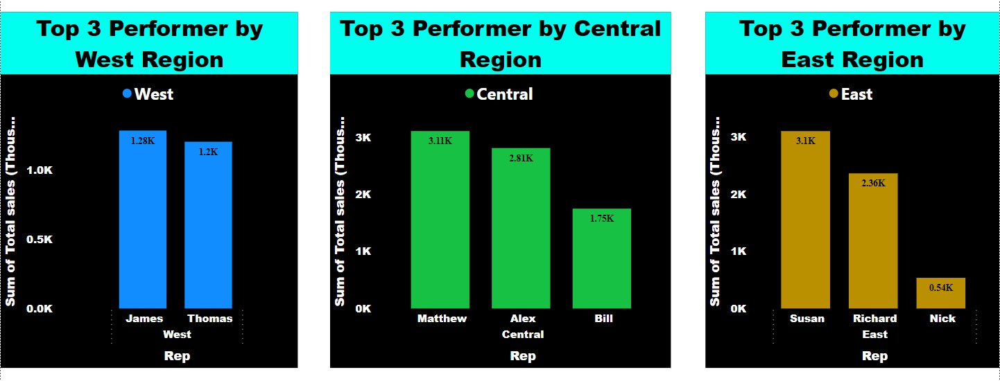

# Section 2: Challenge

#### It's EOFY and that means time for annual bonuses!

##### The store operates in three region and only the top-performing employee in each region qualifies for a bonus. Find out which three employees are eligible to get bonuses for this year

##### Employees are measured on total sales ($$)

Dataset:- **P6-OfficeSupplies.csv**

Created new column Total sales

> Total sales = 'P6-OfficeSupplies'[Unit Price] * 'P6-OfficeSupplies'[Units]

NOTE:- As we can't apply more than 1 filter on 2 or more column/category in a single chart, i have gone by creating 3 charts shown below.

